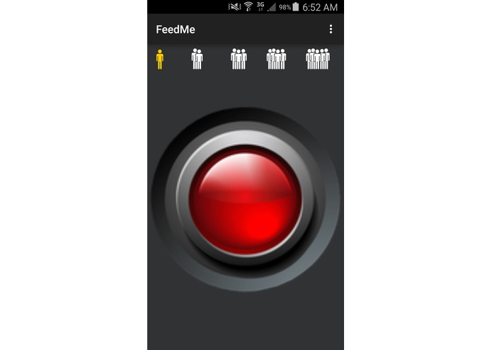
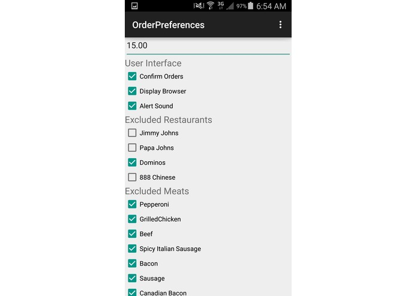
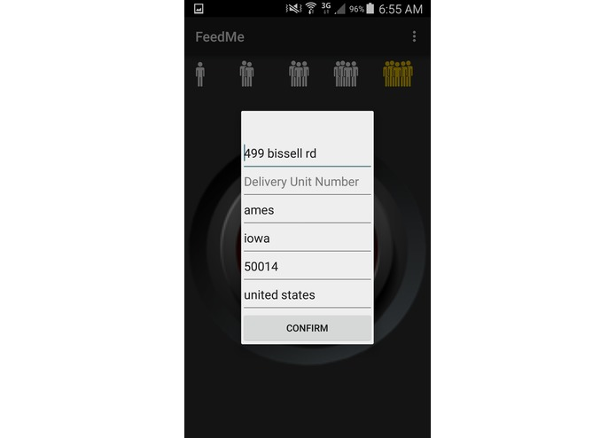
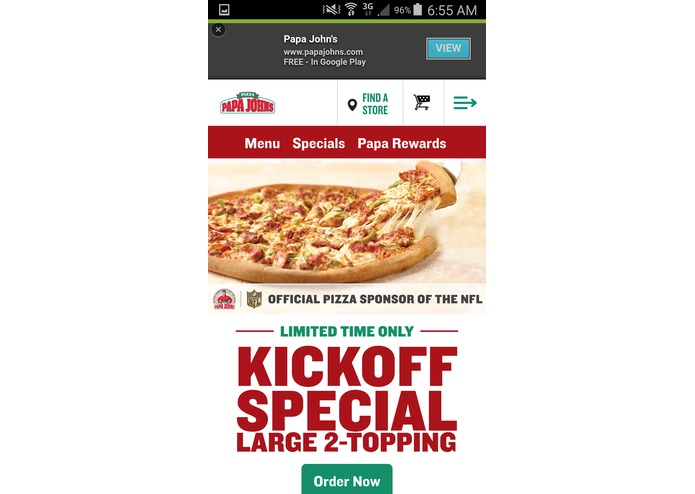

# FeedMe
FeedMe is a randomized food delivery app for android. It is still in development. 

The goal for the app is to be able to open up the app on your phone and select the number of people you are with and press the launch button. The app will then choose a restaurant and a meal based on your preferences and order the food for you, having it delivered directly to your location, all at the touch of a button. 

Currently the app has two restaurants implemented: Dominos and PapaJohns and JimmyJohns is soon to be added.

This is the first and main screen of the app when you open it.

If you press the settings button at the top right and select order preferences it will show you the order preferences page where you can set what you would like and not like on your orders including food items, cost per person, and even whole restaurants.

Once you are ready to order simply press the big red button on the main screen. This will launch the ordering process. The first step of ordering is to quickly confirm you address. The app tries to guess where you are so it takes a second before it pops up sometimes.

Now the ordering process has begun, simply watch as the app decides a meal for you based on your preferences. Currently the app will wait at the end for you to confirm the order before proceeding.

